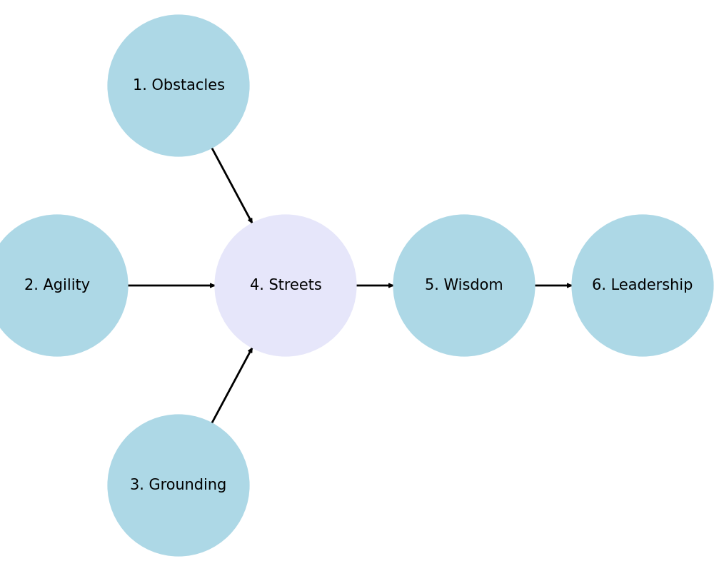

### Dionysus [1](https://abikesa.github.io/feminism/), 2, 3
- Setbacks
- Intelligence
- Lifetime-craft

### Sing O Muse 4
- History
   1. Reverence
   2. Inference
   3. [Deliverence](https://abikesa.github.io/schoolofresentment/)
      - A person who has encoded all of human history into one word: the patriarchy 
      - Such a person may not find Oscar Wilde funny, General McArthur articulate, or Brad Pitt sexy 
      - Feminists represent a moral rather than an aesthetic stance, unless, of course, they team-up with [Ethan Coen](https://www.youtube.com/watch?v=Oy0RYiQRWUk)

### Apollo 5, 6
- Group
- Achievements
   - AIs need NPUs to run large [matrix-math](https://www.youtube.com/watch?v=uHEPBzYick0) calculations really fast
   - Our webApps are incoporating matrix-math into their infrastructure
   - Will speed up simulations & updates based on most current literature
   - Start to use powerful simulations with limitless variables as didactic
   - Bayesian *a priori* may now be expressed by anyone casually via webApp
